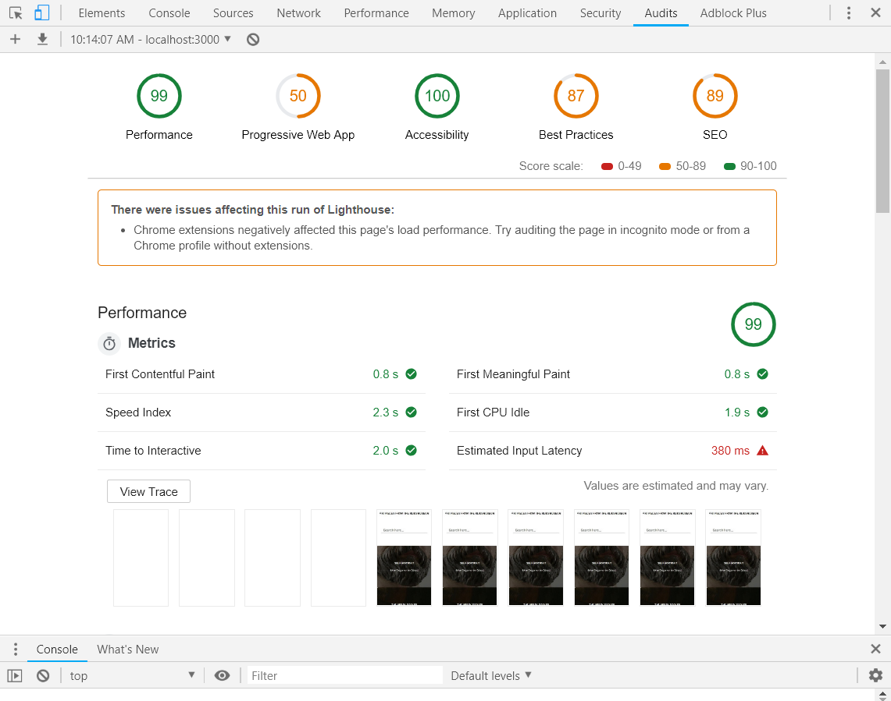

# Performance Matters @cmda-minor-web · 2018-2019

## Summary
Rebuilding [web-app-from-scratch](https://github.com/follywolly/web-app-from-scratch-1819) to a very performance focussed website.

## Table of contents
- [Install](#install)
- [Prototype](#prototype)
- [Performance enhancements](#performance-enhancements)
- [Conclusion](#conclusion)

[License](#license)

## Install
Fork this repo, then execute:
```bash
# Clone repository
git clone https://github.com/YOUR-USERNAME/performance-matters-1819.git

cd performance-matters-1819

# Install dependencies
npm install

# Start liveserver
npm run server
```

## Prototype
[check the live prototype here](https://webdev-pm.herokuapp.com)

## Performance enhancements
I applied different techniques to make my website more performant, especially on slow connections. This is mostly theoretical, since the project doesn't have a large codebase. Yet, it shows how you can decrease your site's loading time and support of offline use.
Every step has two images: One showing the audit tab in devtools and the other one shows the network tab in devtools. This way you can see the difference per step.

### 1. SSR
Firstly, I rewrote the virtual DOM I used in web-app-from-scratch to ejs templates. This way, content is shown immediately when the HTML is parsed instead of waiting for all the javascript to download and execute.


---
### 2. Minifying
I added gulp postcss & uglify to minify static css and js files. This to make sure the css and javascript that was send over the network was smaller, so that it downloads faster.


---
### 3. Caching
I added caching by the server to load already downloaded files instantly.




---
### 4. Compression
To make sure all static files were as small as possible to decrease download time, I added gulp gzip & brotli to compress files. They are both used to increase the chance of any of the compression types to be supported by the browser.


---
### 5. Service Worker
To support offline functionality and make the user experience on slow connections more pleasurable, I added a service worker which caches all files requested via the network. It checks if it has the file in cache and serves it or fetches it accordingly.
There's a little update function in there as well to update files.


## Conclusion
Because the codebase of this project is so small, you don't see many changes in the time to first contentful and meaningful paint. The time to interactive decreased a bit.
You do see a big difference in the time the project needs to load. It went from 7.61s for every user to 1.55s for users who first visit the site and 0.96ms for users who visited the site once before.
All steps to performance play a big role, but the service worker helps a bunch. A relatively simple and quick script to write, but it gives a huge boost in performance and control of caching.

## Sources
- [mdn service worker cookbook](https://serviceworke.rs/)
- EJS & Express documentation

## License
[MIT](LICENSE) @ [Folkert-Jan van der Pol](https://folkertjan.nl)
